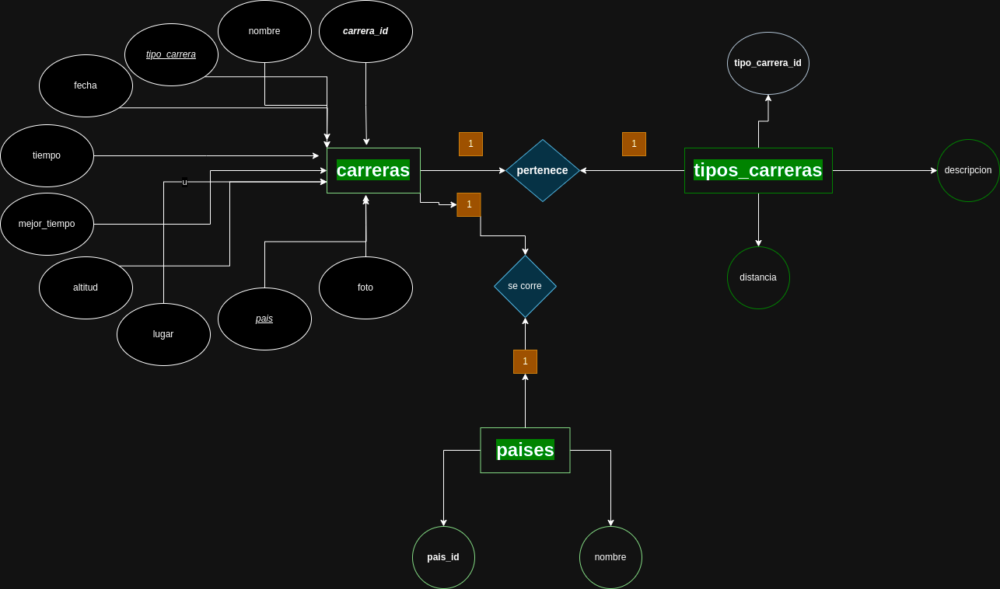
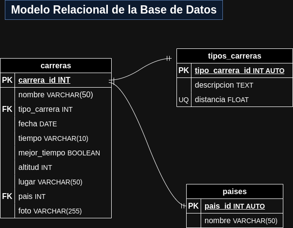

# Carreras

## Listado de Entidades

### carreras **(ED)**

- carrera_id **(PK)**
- nombre
- tipo_carrera **(FK)**
- fecha
- tiempo
- mejor_tiempo
- altitud
- lugar
- pais **(FK)**
- foto

### tipos_carreras **(EC)**

- tipo_carrera_id **(PX)**
- descripcion
- distancia **(UQ)**

### paises **(EC)**

- pais_id **(PK)**
- nombre

## Relaciones

1. Una **carrera** _pertenece_ a un **tipo_carrera**. (_1 a M_)
1. Una **carrera** se _corre_ en un **pais**. (_1 a M_)

## Diagramas

### Modelo Entidad - Relación

### Modelo Relacional

## Reglas de Negocio

<!-- Las reglas de negocio son las reglas que se establecen para que el usuario pueda almacenar, manipular la información -->

### carreras

1. Leer todos los registros de la entidad carreras
1. Leer el registro de una(s) carrera(s) dada una condición
1. Crear el registro de una carrera
1. Actualizar los datos de una carrera
1. Eliminar los datos de una carrera dada una condición

### tipos_carreras

1. Todos los valores del atributo distancia, deberán estar expresados en _km_ y no se podrán repetir.
1. Leer todos los registros de la entidad tipos_carreras
1. Leer el registro de un(os) tipo(s) de carrera(s) dada una condición
1. Crear el registro de un tipo de carrera
1. Actualizar los datos de un tipo de carrera dada una condición
1. Eliminar los datos de un tipo de carrera dada una condición

### paises

1. Leer el registro de la entidad paises
1. Leer el registro de un(os) pais(es) dada una condición
1. Crear el registro de un pais
1. Actualizar los datos de un pais dada una condición
1. Eliminar los datos de un pais dada una condición
