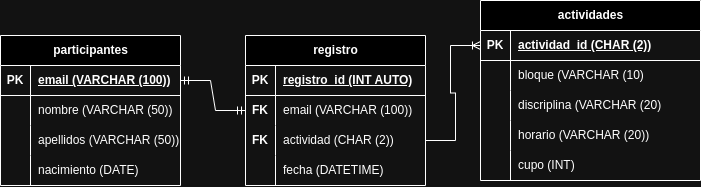

# Entrena tu Glamour

## Requisitos del Sistema

- Registrar participantes para el evento Entrena tu _Glamour_
- El evento tendrá 4 disciplinas: _KickBoxing_, Pilates, Yoga y Zumba
- Cada disciplina tendrá bloques de horarios:
  - Bloque 1 de 9:00 a 12:00
  - Bloque 2 de 14:00 a 17:00
  - Bloque 3 de 18:00 a 21:00
- Cada actividad tendrá un máximo de 10 participantes, excepto Yoga que tendrá 20.
- Cada participante solo se podrá registrar a una sola actividad

## Listado de Entidades

### actividades **(EC)**

- actividad_id **(PK)**
- bloque
- disciplina
- horario
- cupo

<!-- De esta forma se vería nuestra tabla en la base de datos  -->

| actividad_id | bloque   | disciplina  | horario       | cupo |
| ------------ | -------- | ----------- | ------------- | ---- |
| 1K           | Bloque 1 | KICK BOXING | 9:00 a 12:00  | 10   |
| 1Y           | BLOQUE 1 | YOGA        | 9:00 a 12:00  | 20   |
| 1P           | BLOQUE 1 | PILATES     | 9:00 a 12:00  | 10   |
| 1Z           | BLOQUE 1 | ZUMBA       | 9:00 a 12:00  | 10   |
| 2K           | BLOQUE 2 | KICK BOXING | 14:00 a 17:00 | 10   |
| 2Y           | BLOQUE 2 | YOGA        | 14:00 a 17:00 | 20   |
| 2P           | BLOQUE 2 | PILATES     | 14:00 a 17:00 | 10   |
| 2Z           | BLOQUE 2 | ZUMBA       | 14:00 a 17:00 | 10   |
| 3K           | BLOQUE 3 | KICK BOXING | 18:00 a 21:00 | 10   |
| 3Y           | BLOQUE 3 | YOGA        | 18:00 a 21:00 | 20   |
| 3P           | BLOQUE 3 | PILATES     | 18:00 a 21:00 | 10   |
| 3Z           | BLOQUE 3 | ZUMBA       | 18:00 a 21:00 | 10   |

### participantes **(ED)**

- email **(PK)**
- nombre
- apellidos
- nacimento

### registro **(ED | EP)**

- registro_id **(PK)**
- email **(FK)**
- actividad **(FK)**
- fecha

## Relaciones

1. Un **participante** crea un **registro** (_1 - 1_)
1. Una **actividad** se asigna a un **registro** (_1 - M_)

## Diagramas

## Modelo Relacional de la BD

## Reglas de Negocio

### actividades

1. Leer todas las actividades
1. Leer una actividad
1. Crear una actividad
1. Eliminar una actividad
1. Actualizar una actividad

### participantes

1. Leer todos los participantes
1. Leer un participante en particular
1. Crear un participante
1. Eliminar un participante

### registros

1. Leer todos los registros
1. Leer un registro en particular
1. Crear un registro
1. Actualizar un registro
1. Eliminar un registro

### lógica y validaciones de requisitos

- Registrar un participante implica:
  - Validar cupo de la actividad
  - Insertar datos a las entidades participantes y registros
  - Restar uno al atributo cupo de la entidad actividades
- Listar registros
- Eliminar participante implica:
  - Eliminar datos a las entidades participantes y registros
  - Sumar uno al atributo cupo de la entidad actividades
